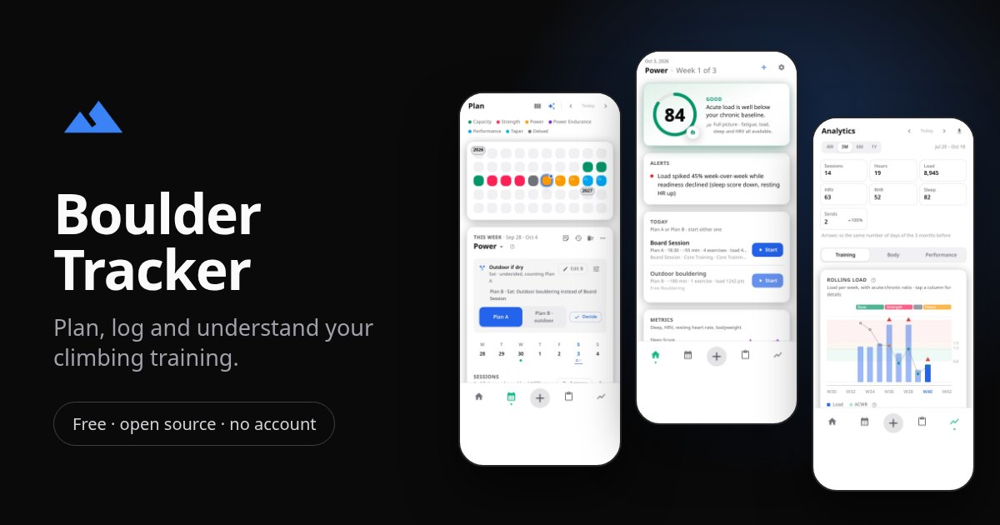
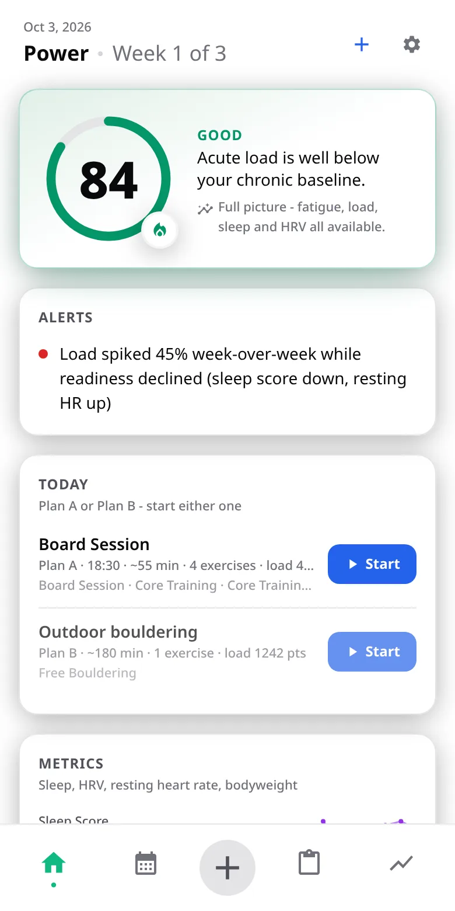
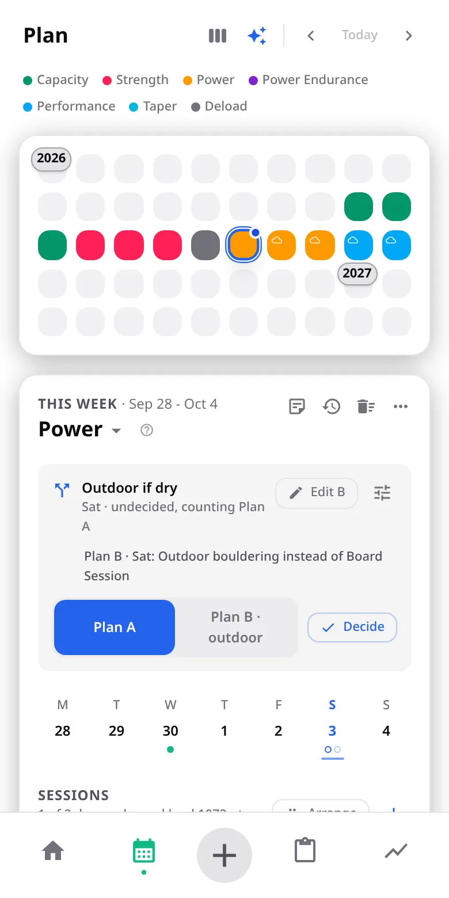
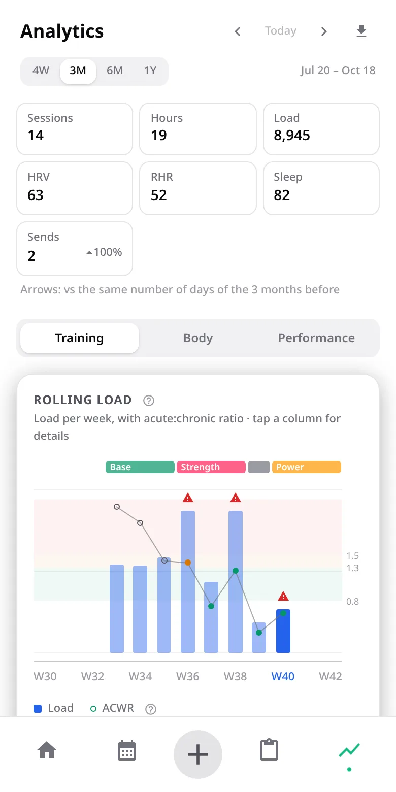

# Boulder Tracker

**Plan, log and understand your climbing training.** Free, open source, no account: your data stays on your device.



Boulder Tracker is a training planner and log for bouldering and climbing, built with Svelte 5 and Vite. It runs in the browser, installs as a web app on iPhone and Android, and as a native Android app.

<p align="center">
  
  
  
</p>

## Install

Everything is at **https://bouldertracker.nathanzumbusch.de/**.

### Android app

It adds Google Drive sync, home-screen widgets, reminders, launcher shortcuts, Health Connect and timer sound with the screen off. It is not in the Play Store, so you install the APK yourself:

1. Download [boulder-tracker.apk](https://bouldertracker.nathanzumbusch.de/android/stable/boulder-tracker.apk) on your phone and open it.
2. If Android asks, allow your browser to **install unknown apps**, then go back and tap Install.
3. Play Protect may say it hasn't seen the app before, because it isn't from the Play Store. Tap **More details → Install anyway**.
4. Updates arrive inside the app (Settings → About & Help → App updates). Each one is checked against its SHA-256 before Android installs it, and a backup is saved first.

Needs Android 8 (API 26) or newer.

### iPhone and iPad

Open the site in **Safari**, tap Share → **Add to Home Screen**. (Links opened inside Reddit, Instagram and other apps can't install: open them in Safari first.) The Home Screen app keeps its own data, so set it up there rather than in the browser tab.

### Any browser

Just [open the web app](https://bouldertracker.nathanzumbusch.de/). It works offline once loaded.

### What works where

| | Android app | iPhone Home Screen | Browser |
| --- | --- | --- | --- |
| Works offline | Yes | Yes | Once loaded |
| Google Drive sync | Yes | No | No |
| Reminders | Yes | No | No |
| Timer sound, screen locked | Yes | No (keep the screen on) | No (keep the screen on) |
| Widgets, shortcuts | Yes | No | No |
| Health Connect import | Yes | No | No |
| Backups | Automatic, weekly | By hand | By hand |

A browser (Safari especially) can erase a website's data after a while. Installing to the Home Screen and saving a backup file now and then (Settings → Data & Exports) keeps your training safe.

## Is the APK safe? Check it yourself

The APK is built by GitHub's servers from this repository on every release (`.github/workflows/deploy.yml`), and each build records the commit it came from. On the [site](https://bouldertracker.nathanzumbusch.de/about.html#verify) you'll find the commit, SHA-256 and signing certificate of the current build. To check on a computer:

```bash
sha256sum boulder-tracker.apk                      # must match the SHA-256 on the site
apksigner verify --print-certs boulder-tracker.apk # who signed it
gh attestation verify boulder-tracker.apk --repo NZumbusch/boulder-tracker
```

The last command asks GitHub to confirm this exact file was produced by this repository's workflow. (Builds from before attestations were added don't have one.) The signing key is the developer's own, so Android treats an update signed with any other key as a different app: see [docs/signing.md](docs/signing.md).

## Feedback

Found a bug, or want something? Open an [issue](https://github.com/NZumbusch/boulder-tracker/issues/new), or use Settings → About & Help → *Report a bug or send feedback* in the app, which prefills your version and device. Training aids here (readiness, load, pain tracking, AI prompts) are not medical advice.

## What it does

- **Plan**: phases with a typical week each, training blocks that assign phases to weeks, and per-week edits on top. Goals (competitions and outdoor trips, with projects) sit on the same calendar.
- **Train**: a live session with a timer, interval and set runs, logging each exercise against its target. Any session opens in one full-screen view: start it, edit it in place, or log it as planned.
- **Home**: readiness (fatigue, load ratio, sleep, HRV), today's sessions, the week so far, the current block, the next goal, weather and rock conditions at home and your crags, alerts, and progress. Every card can be reordered or hidden.
- **History and sends**: completed sessions and outdoor sends (8a.nu CSV import) with shared filters, and a grade chart.
- **Analytics**: rolling load with the acute:chronic ratio, training mix, fatigue, adherence, recovery warnings, outdoor grades, bodyweight and benchmarks.
- **AI coach**: builds a prompt with your plan and history to paste into any AI chat (ChatGPT, Claude, Gemini…), then imports its reply as a reviewable list of changes. The same flow fills or logs a single session.
- **First run**: a short welcome (training level, units, home location; on iPhone Safari the install steps first), then an optional tour of every screen on example data (`src/lib/tour/`, steps in `steps.ts`). Replay from Settings → About & Help.
- **Data**: JSON backup and restore, CSV / PDF / calendar export, and on Android local notifications (post-session rating, daily metrics).

## Development

```bash
npm install
npm run dev      # dev server
npm test         # vitest
npm run check    # svelte-check (types)
npm run build    # production build into dist/
npm run icons    # regenerate the offline icon bundle after using a new icon
```

Icons are bundled rather than fetched from the Iconify API, so the app works offline. A test fails if an icon is used but not bundled; `npm run icons` fixes it.

## Android

Needs Android Studio.

```bash
./setup-android.sh   # first time: installs, builds, adds the Android platform
./run_android.sh     # afterwards: builds, syncs and opens Android Studio
```

`android/` is tracked in git (manifest, `MainActivity`, launcher shortcuts in `res/xml/shortcuts.xml`, the widget); local Capacitor plugins live in `plugins/` (`timer-service`, `drive-sync`, `home-widget`, `health-connect`). The app needs Android 8 (API 26) or newer, for Health Connect's client library. The project builds with JDK 21 (Android Studio's own, `/opt/android-studio/jbr`).

### Health Connect

Settings → Data & Exports → Health Connect reads resting heart rate, weight and sleep (read-only) and stores one value per day: `rhr`, `bodyweight` and `sleep-duration` (hours). Values typed by hand win; imported entries carry `source: "health-connect"` and fixed ids, so a second importing device doesn't duplicate them through sync. Logic: `src/lib/health/` (tested); native side: `plugins/health-connect` (Kotlin). Health Connect requires a privacy policy to grant access - the plugin's rationale screen opens `privacy.html#health-connect`.

### Google Drive sync - one-time setup

Sync (Settings → Data & Exports → Sync) uses each user's own Google Drive app folder; there is no server. Google only hands out Drive access to apps registered in a Google Cloud project, so once:

1. [Google Cloud console](https://console.cloud.google.com) → create a project (e.g. "Boulder Tracker").
2. *APIs & Services → Library* → enable **Google Drive API**.
3. *Google Auth Platform* (OAuth consent screen) → set it up as **External**, with an app name and your email. Under *Audience*, either add your Google account as a test user (in *Testing*, Google asks you to sign in again every 7 days) or **publish** it - `drive.appdata` is a non-sensitive scope, so publishing needs no review.
4. *Clients* → create an **Android** OAuth client: package name `com.nzumbusch.bouldertracker`, and the SHA-1 of the key the APK is signed with. For debug builds from a machine: `keytool -list -v -keystore ~/.android/debug.keystore -storepass android -alias androiddebugkey`. Each signing key (another computer, a release key) needs its own Android client in the same project.

No client ID goes into the code - Play services matches the app by package name and signature. How sync works: `src/lib/sync/` (`merge.ts`, `syncEngine.ts`, `driveSync.svelte.ts`).

## Deployment

Pushing to `main` builds the app and deploys it to GitHub Pages (`.github/workflows/deploy.yml`), served at https://bouldertracker.nathanzumbusch.de/. The build uses a relative base path, so the same `dist/` works on Pages and inside the Android app.

### Web app (PWA)

`vite-plugin-pwa` (in `vite.config.js`) writes the manifest and a service worker that precaches the whole build, so the installed app opens offline. A new deploy shows a "Reload" toast rather than switching under a running session (`src/lib/pwa/pwa.ts`); the service worker is not registered inside the Android app. Home-screen icons are PNGs in `public/icons/`, rendered by `node scripts/generate-pwa-icons.mjs`.

What the web app can't do, on iOS in particular: scheduled reminders, timer beeps with the screen locked (keep the screen on - Settings → Appearance & Behaviour → Live sessions), Drive sync, widgets and shortcuts (Android only). On iPhone the Home Screen app has its own storage, separate from Safari's.

### Android app updates

The same workflow builds a signed release APK and publishes it with `android/version.json` under https://bouldertracker.nathanzumbusch.de/android/. The app checks that file on start (Settings → About → App updates), offers newer builds on Home, downloads the APK, checks its SHA-256 and opens Android's installer (`plugins/app-updater`, `src/lib/update/`). The build number is the commit count on `main`, so CI builds and Android Studio builds of the same commit match.

Two channels, chosen in the app (Settings → About → App updates): **Testing** gets every push to `main` (`/android/`); **Stable** only promoted builds (`/android/stable/`). To promote: Actions → "Deploy web app and Android update to Pages" → Run workflow → mode `promote`. It takes the test build that's live - the exact APK, checked against its SHA-256 - and stores it as the assets of the `stable-channel` release, which every deploy copies back into the site. New installs default to Stable; a device switched to Stable while ahead of it waits for the next stable build newer than its own (Android can't downgrade).

Signing needs four repository secrets (Settings → Secrets and variables → Actions); without them only the web app deploys:

| Secret | Value |
| --- | --- |
| `ANDROID_KEYSTORE_BASE64` | `base64 -w0 ~/.android/debug.keystore` (the key the installed app is signed with) |
| `ANDROID_KEYSTORE_PASSWORD` | `android` for the debug keystore |
| `ANDROID_KEY_ALIAS` | `androiddebugkey` |
| `ANDROID_KEY_PASSWORD` | `android` |

It must stay the same key: Android only installs an update signed like the installed app, and the Drive OAuth client is registered for that key's SHA-1. Locally, release builds without these variables are signed with the debug key too.

## Where things live

```
src/
  App.svelte              screen switch, bottom nav, app-wide modals
  components/
    dashboard/            Home, one component per card in home/
    plan/                 planner, blocks, goals, AI Coach
    workout/              the workout modal (view / edit), live session, timer, start screen
    history/, sends/      History tab: sessions and outdoor sends
    analytics/            Analytics screen and its panels
    settings/             Settings screens
    common/               shared sheets and modals
  lib/
    state.svelte.ts       trainingState: the app-wide facade over the stores
    stores/               reactive stores per domain (workouts, planning, catalog, …)
    storage/              persistence (IndexedDB on web, a JSON file on Android) and data migrations
    types.ts              the data model
    analytics/            load formulas, ACWR, readiness, progress
    planning/             week projection, schedule, durations, block outlook
    ai/                   prompts, reply validation, change planning
    session/              live-session logic
    preferences/          device settings, tunables, Home card options
    weather/, sends/, goals/, alerts/, notifications/, timer/, share/, …
```

Most logic is in plain TypeScript modules under `src/lib/` with tests next to them; components mostly render it.

### Data and migrations

Stored data carries a version (`DATA_EXPORT_VERSION` in `src/lib/constants.ts`). On startup, older data, including imported backups, is upgraded step by step by `src/lib/storage/migrations.ts`. A backup is kept, and the upgrade is rolled back if its safety checks fail. A shipped migration step is never changed afterwards; a new one is added instead.

Weeks that follow their phase aren't stored. They're projected from the phase's typical week until you edit them, and only then written out (see `src/lib/planning/weekProjection.ts`).

## Licence

[MIT](LICENSE). Weather data by [Open-Meteo.com](https://open-meteo.com) (CC BY 4.0).
